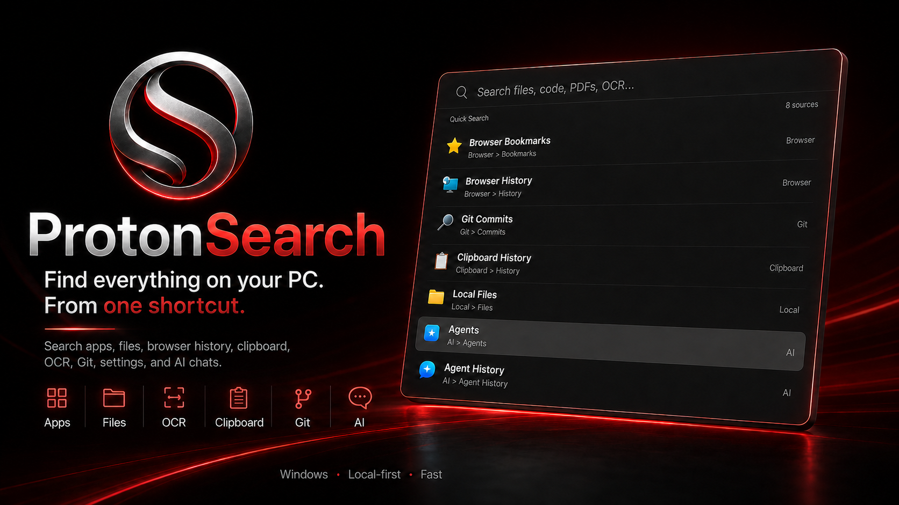

<p align="center">
  
</p>

<h1 align="center">ProtonSearch</h1>

<p align="center">
  <em>Find everything on your PC. From one shortcut.</em>
</p>

<p align="center">
  
  <a href="LICENSE"></a>
  <a href="https://github.com/PranshulSoni/protonsearch/stargazers"></a>
  <a href="https://github.com/PranshulSoni/protonsearch/releases"></a>
  <a href="https://github.com/PranshulSoni/protonsearch/releases"></a>
</p>

ProtonSearch is a fast, local-first Windows launcher that helps users find and open anything already on their PC from one keyboard shortcut.

A fast, local-first Windows launcher to search apps, files, browser history, clipboard, OCR text, Git activity, your activity timeline, settings, commands, and AI chats from one shortcut.

> **Formerly OmniSearch.** ProtonSearch is the same project under a new name. If you're upgrading from an OmniSearch install, your search index, settings, clipboard history, snippets, and AI configuration all carry over automatically on first launch — nothing to reconfigure.

<p align="center">
  
</p>

## Why ProtonSearch?

Your work is already on your PC, but Windows spreads it across too many places.

Apps are in Start Menu. Files are in Explorer. Browser pages are hidden in history. Clipboard items disappear. Screenshots need OCR. Git activity lives somewhere else. AI chats become another place to manually search.

ProtonSearch brings all of it into one fast, keyboard-first command center. Press `Alt + Space`, type what you remember, and open the right thing instantly.

## What Makes It Different?

- **One search box for everything** — apps, files, folders, browser history, clipboard, OCR text, Git activity, notes, your activity timeline, Steam games, settings, commands, and AI chats.
- **Local-first by design** — your indexed data stays on your PC.
- **Built for speed** — native Rust/Win32 app with SQLite FTS5 search.
- **Keyboard-first workflow** — open with `Alt + Space`, search naturally, press `Enter`.
- **Visual search** — circle any part of your screen and search it instantly with Google Lens.
- **Built-in calculator and unit converter** — type `15% of 340` or `5 km to miles` and get the answer directly in your results.
- **Custom quicklinks and snippets** — trigger your own keyword-based site searches and reusable text expansions without leaving the search bar.
- **Window and desktop management** — snap, move, and resize windows, and switch between them and virtual desktops, all from the keyboard.
- **A real clipboard workflow** — search clipboard history, pin important items, select multiple clips, copy images, edit text clips, and paste combined selections.
- **Hermes agent support** — use Hermes to run autonomous tasks, execute approved commands, and help control your PC from the launcher.
- **Made for Windows power users** — replaces the friction of jumping between Start Menu, File Explorer, browser history, Settings, and AI tools.

## Demo Video

<!-- [This text is completely hidden in preview mode](https://github.com/user-attachments/assets/d37e6edf-e9ba-46a8-98e5-5a96454c4971) -->
<video src="https://github.com/user-attachments/assets/d37e6edf-e9ba-46a8-98e5-5a96454c4971" controls width="100%">
  Your browser does not support the video tag.
</video>

## Star On GitHub

If ProtonSearch looks useful, star the repo so more Windows users can find it:

[Star ProtonSearch on GitHub](https://github.com/PranshulSoni/protonsearch)

## Installation

> **Recommended install**
>
> Run this in Windows PowerShell:
>
> ```powershell
> curl.exe -fsSL https://raw.githubusercontent.com/PranshulSoni/protonsearch/lean-build/scripts/install.ps1 | powershell -NoProfile -ExecutionPolicy Bypass -
> ```
>
> This downloads the latest ProtonSearch release from GitHub and opens the Windows installer.

Manual download: get the latest Windows build from the [ProtonSearch releases page](https://github.com/PranshulSoni/protonsearch/releases), then run the installer.

Already have OmniSearch installed? Just install ProtonSearch over it — your data moves over automatically, and the installer cleans up the old OmniSearch program files for you.

After installation:

1. Launch ProtonSearch.
2. Press `Alt + Space`.
3. Add or confirm indexed folders in Settings > Database.
4. Let the first index finish.
5. Start searching.

If `Alt + Space` is already used by another app, change the launcher hotkey in Settings > Hotkeys.

## What You Can Search

| Source | What ProtonSearch finds |
|---|---|
| Apps | Installed desktop apps, Microsoft Store apps, and Windows utilities |
| Files and folders | Indexed local files, folders, recent files, documents, downloads, and projects |
| File content | Text inside supported documents, PDFs, Markdown, text files, and source files |
| Images and screenshots | Image files plus OCR text extracted from screenshots, pictures, and copied clipboard images |
| Browser data | Bookmarks and recent history from Chromium-based browsers and Firefox |
| Clipboard | Text and image clipboard history, pinned clips, multiselect actions, image copy, editing, and bulk cleanup |
| Git | Repositories, commits, branches, and TODO/FIXME comments |
| Activity timeline | A unified, searchable history of browser visits, Git commits, and other tracked activity |
| Notes | Quick local notes saved from the launcher |
| Open windows | Currently open application windows, searchable by title |
| Focus categories | Saved app-blocking presets for distraction-free focus sessions |
| Games | Installed Steam library games, launched directly |
| Windows Settings | Modern Windows Settings pages and classic Control Panel pages |
| Commands | Local ProtonSearch actions like clipboard, agents, windows, settings, and system actions |
| Agents | Saved AI agents, agent chats, and AI chat history |

## Useful Details

ProtonSearch also includes smaller workflow features that make it useful every day:

- **Clipboard pinning** — keep important snippets, links, IDs, commands, and copied text at the top of clipboard search.
- **Clipboard multiselect** — select multiple clipboard items, paste them together, or clean them up in bulk.
- **Image clipboard support** — keep copied screenshots and images searchable by their OCR'd text, then copy them back when needed.
- **Editable clipboard text** — fix or update a saved clipboard item before copying it again.
- **Clipboard-first commands** — paste recent items sequentially, paste the newest screenshot, clear clipboard contents, or ask AI about clipboard text.
- **Circle to Search** — select any region of your screen and send it straight to Google Lens for a visual search, no screenshot tool required.
- **Quicklinks** — register your own keyword, type it followed by a query anywhere in the search bar, and jump straight to that site with your query filled in.
- **Snippets** — save reusable text under a trigger keyword; typing the keyword alone expands it, ready to copy or paste.
- **Calculator and unit converter** — quick math (`2+2`, `sqrt(9)*4`) and unit conversions, answered inline as you type.
- **AI quick commands** — ask, explain, fix grammar, translate, summarize, or find bugs in text without switching apps.
- **Content search** — search inside supported documents, code files, OCR output, screenshots, and notes instead of only matching filenames.
- **Browser recall** — find old pages from browser bookmarks and history without opening the browser first.
- **Windows control surface** — open Windows Settings, Control Panel pages, local commands, windows, and system actions from the same launcher.

## Hermes Agents

ProtonSearch includes Hermes agent integration for users who want more than search.

Hermes can help with autonomous workflows such as running local tasks, executing approved commands, managing agent chats, and assisting with PC control from inside the launcher. Commands that need your approval show an inline prompt before they run. It gives ProtonSearch an agent layer without turning the search bar into a chatbot first.

## Search Prefixes

Prefixes are optional, but useful when you want to search one source directly.

| Prefix | Use it for |
|---|---|
| `file:` | Files and document content |
| `folder:` | Folders only |
| `code:` | Source files and code content |
| `img:`, `image:`, `screenshots:`, or `ocr:` | Image files and OCR text |
| `bookmarks:` | Browser bookmarks |
| `history:` | Browser history |
| `clip:` or `clipboard:` | Clipboard history |
| `commits:` | Git commits |
| `todos:` | TODO/FIXME comments in your code |
| `switch:` or `window:` | Open application windows |
| `focus:` | Saved focus-session app-blocking categories |
| `notes:` | Local notes |
| `memory:` | The unified activity timeline |
| `games:` | Installed Steam games |
| `quicklink:` or `ql:` | Your saved quicklinks |
| `snippet:` or `snip:` | Your saved text snippets |
| `agents:` | Available AI agents |
| `agentchats:` | Agent chat history |
| `chatgpt:` | Send a prompt straight to ChatGPT |

Quicklinks and snippets can also be triggered without a prefix: type a registered keyword followed by your query to fire a quicklink, or just the trigger word alone to expand a snippet.

## Settings App

ProtonSearch also includes a settings app for controlling the launcher.

From settings you can manage:

- General launcher behavior
- Appearance/theme
- Hotkeys
- Agents and AI endpoint configuration
- Indexed folders and database/index status

The app runs from the Windows system tray, so the launcher can stay available in the background without keeping a large window open.

## Privacy

ProtonSearch is local-first.

Runtime data is stored on your PC under:

```text
%APPDATA%\protonsearch
```

The local database stores indexed metadata, searchable text, browser items, clipboard history, chats, agents, and settings. Expensive or large data is capped where needed so the app stays responsive instead of trying to keep everything in memory.

## Performance

ProtonSearch is a native Rust/Win32 app, not an Electron app.

Current implementation details:

- Native Windows UI and system integration.
- SQLite FTS5 for fast full-text search.
- Debounced search input to avoid doing heavy work on every keystroke.
- Background indexing for files, browser data, Git activity, clipboard, and OCR.

The goal is simple: open fast, search fast, and stay light enough to leave running all day.
